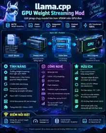

# VN Mod Stream GPU

[🇻🇳 Tiếng Việt](#tieng-viet)



VN Mod Stream GPU is an experimental `llama.cpp` modification for people who want to run **larger GGUF AI models on a single NVIDIA GPU even when the model does not fit completely inside VRAM**.

Instead of solving low VRAM mainly by moving transformer computation to the CPU, the mod keeps the supported transformer workload on CUDA and streams only the required model weights from system RAM into reusable VRAM space.

The practical goal is simple: **use the RAM already available in the computer as a backing store for model weights, while preserving GPU computation as much as the supported model allows.**

> **Experimental community release:** this project is shared so users and developers can test, improve, and extend it. At this time, only the models and hardware explicitly listed in the Tested section are declared as validated.

## What problem does it solve?

A common limitation of local AI is that a useful model may be larger than the GPU's VRAM.

For example, a 12 GB GPU must hold not only model weights, but also context/KV cache, CUDA runtime memory, Vision/mmproj memory, MTP memory when used, and temporary compute buffers. Even a model whose file size appears close to 12 GB can therefore run out of VRAM when context grows.

Traditional CPU/RAM offloading can make the model fit, but moving transformer work to the CPU can reduce inference speed significantly.

VN Mod Stream GPU takes a different approach:

**System RAM stores the streamed weights → VRAM receives the blocks currently needed → CUDA performs the supported transformer computation.**

This allows VRAM to behave more like a high-speed working area rather than requiring the entire model to stay there at once.

## What can users use it for?

The current design is useful for single-GPU systems where VRAM is the limiting resource, especially for workloads such as:

- **Running a GGUF model larger than available VRAM** on supported model layouts.
- **Long-context chat and assistants**, where KV/context memory would otherwise leave too little VRAM for model weights.
- **AI coding and large codebase analysis**, where long prompts and repository context can consume substantial memory.
- **RAG and long-document workloads**, where larger context windows are useful for keeping more retrieved information in one request.
- **Vision workloads**, where mmproj/Vision memory also competes for VRAM and is included in the server-side memory accounting.
- **Embedded MTP models**, where the supported resident MTP path is accounted for together with the target model.
- **Local or internal `llama-server` deployments** on one NVIDIA GPU, including consumer GPUs in the 12 GB class.

These are intended use cases. Compatibility still depends on the model layout and the Tested section below should be treated as the current validated scope.

## What the user gets

### 1. Load models that do not fully fit in VRAM

The mod can keep selected model weights in system RAM and move only the transformer blocks required for the current computation into VRAM.

This means the model no longer needs to keep every streamable weight resident on the GPU at the same time.

### 2. Keep supported transformer compute on the GPU

The goal is not merely to make a large model load. The supported streaming path keeps transformer computation on CUDA rather than silently moving those transformer operations to the CPU.

That is the main difference from CPU-heavy offloading.

### 3. More room for long context

VRAM is also needed by the KV cache and other runtime allocations. By reducing how much model-weight memory must remain resident at once, more of the GPU memory budget can be left available for context and runtime needs.

The actual context limit still depends on the model, quantization, KV-cache type, batch settings, Vision/MTP usage, and system hardware.

### 4. Automatic VRAM planning

With:

```sh
--vn-mod-gpu-wstream auto
```

the mod inspects the model and selected CUDA GPU, accounts for the configured VRAM budget and reserve, estimates runtime CUDA use, and decides which supported transformer blocks need streaming.

The user does not have to manually choose individual layers or blocks to stream.

### 5. Persistent pinned RAM

Streamed weights are kept in pinned host memory so they can be transferred efficiently to the GPU when required.

They are not intentionally re-read from the GGUF file for every generated token.

### 6. Reusable CUDA slots

The current implementation uses two reusable CUDA slots for streamed transformer blocks.

Instead of permanently allocating VRAM for every streamed block, those slots are reused as inference moves through the model.

### 7. Async transfer and prefetch

While the GPU is processing the current supported block, the runtime can prepare the next required block and transfer weights from host memory toward VRAM.

The purpose is to hide part of the RAM-to-GPU transfer cost behind useful GPU work when the execution path permits it.

### 8. Profile Cache and Plan Cache

The first validated run may need to inspect the model and build a streaming plan.

The resulting profile and plan can be cached. When the model identity, hardware and relevant runtime configuration still match, later starts can reuse valid cached information instead of repeating all profiling/planning work.

### 9. Vision memory accounting

When Vision/mmproj is used through the integrated server path, its estimated GPU memory usage is included in the streaming budget instead of being ignored.

This helps prevent a plan that looks valid for text-only inference but leaves too little VRAM once Vision is loaded.

### 10. Embedded MTP support

The current supported speculative path is resident **embedded MTP**. Its model/runtime CUDA requirements are included in the memory accounting.

Other speculative configurations are currently outside the supported auto-streaming path.

### 11. Works with useful llama.cpp memory optimizations

The mod is designed to coexist with compatible `llama.cpp` runtime choices such as **Flash Attention** and quantized **K/V cache** configurations, including the Q4_0 K/V-cache direction used in testing.

These features remain `llama.cpp` options; VN Mod Stream GPU does not replace them.

## How it works in practice

A simple way to think about it is:

- **System RAM = model-weight storage area**
- **VRAM = fast working area**
- **CUDA GPU = compute engine**

During startup and inference:

1. **The model is inspected.**  
   VN Mod Stream GPU identifies the supported transformer structure and determines which weights are eligible for streaming.

2. **VRAM needs are calculated.**  
   The runtime considers the GPU budget, safety reserve, context/runtime CUDA allocations, and supported external allocations such as Vision or embedded MTP.

3. **Weights that do not need permanent VRAM residency stay in pinned RAM.**  
   This gives the runtime a fast host-memory source without repeatedly reading the model file.

4. **Two VRAM slots are prepared.**  
   Only the streamed transformer blocks needed around the current execution point occupy these reusable slots.

5. **The next block can be prefetched.**  
   While CUDA computes the current work, the runtime can prepare the next required weight block.

6. **The slot is reused.**  
   After a streamed block is no longer needed, the same VRAM area can be reused for another block later in the model.

7. **The transformer computation remains on CUDA for the supported path.**  
   If the model/runtime layout does not satisfy the streaming contract, loading fails instead of silently changing to an unsupported execution path.

8. **A valid plan can be reused on restart.**  
   Profile/Plan Cache reduces repeated setup work when the same model, hardware and relevant configuration are used again.

In short:

**GGUF on storage → selected weights kept in pinned RAM → required blocks streamed into reusable VRAM → CUDA performs transformer compute.**

## Why this can be faster than CPU-heavy offloading

CPU offloading often reduces VRAM usage by moving both data and part of the computation away from the GPU.

VN Mod Stream GPU instead focuses on moving **weights** through:

**RAM → VRAM → CUDA GPU**

while keeping supported transformer compute on CUDA.

On the declared tested configuration, this provides better practical performance than the CPU-heavy offloading path used for comparison. It does **not** mean RAM-to-VRAM streaming is free: performance still depends heavily on PCIe bandwidth, RAM bandwidth, CPU/platform, model architecture, quantization, context size and GPU.

## Feature summary

| Capability | What it means for the user |
| --- | --- |
| Auto Weight Streaming | No manual block/layer selection for the supported auto path |
| Model larger than VRAM | Streamable weights can remain in RAM instead of all occupying VRAM |
| Long-context headroom | Reduces permanent weight pressure so more budget can be available for KV/runtime memory |
| Persistent pinned RAM | Keeps prepared weights in host memory for efficient repeated GPU transfers |
| 2 reusable CUDA slots | Reuses limited VRAM space for different transformer blocks |
| Async H2D + Prefetch | Attempts to overlap weight transfer with GPU execution |
| CUDA transformer compute | Supported transformer path remains on the GPU |
| Profile + Plan Cache | Reuses validated model/planning information on later starts |
| Vision/mmproj accounting | Includes supported Vision GPU memory in the budget |
| Embedded MTP | Accounts for the supported resident embedded-MTP path |
| Flash Attention compatibility | Can be combined with compatible llama.cpp Flash Attention settings |
| Quantized K/V cache compatibility | Can be combined with compatible llama.cpp K/V-cache settings |
| llama-server integration | Exposes the mod through the normal server workflow after patch/build |
| Single-GPU focus | Designed around one selected CUDA GPU |

## Tested configuration

The current public test was performed with:

- **GPU:** NVIDIA GeForce RTX 3060
- **VRAM:** 12 GB
- **Model:** Qwen3.8 27B
- **Model source:** [ISTA-DASLab/Qwen3.8-27B-GSQ-RCO-GGUF](https://huggingface.co/ISTA-DASLab/Qwen3.8-27B-GSQ-RCO-GGUF)
- **IQ2_S model size:** approximately **9.61 GB**
- **IQ3_S model size:** approximately **12.1 GB**

### Observed context results

| Quantization | Model size | GPU | Observed context |
| --- | ---: | --- | ---: |
| IQ2_S | ~9.61 GB | RTX 3060 12 GB | ~250K |
| IQ3_S | ~12.1 GB | RTX 3060 12 GB | ~124K |

These context values are observations from the declared test environment, not a universal guarantee for every system or model.

### Current tested scope

The mod currently operates well on the declared tested models above.

**No other model family is currently declared as tested.**

Other GGUF models may work, but until they are actually validated they should be treated as untested.

## Before you use it

VN Mod Stream GPU is intended to make limited-VRAM hardware more useful, but it does not turn system RAM into VRAM and it does not remove the physical cost of PCIe transfers.

For best results, users should consider:

- **Enough system RAM** to hold the streamed model weights plus the operating system and other applications.
- **Fast RAM and PCIe bandwidth**, because streamed weights must travel from host memory to the GPU.
- **A sensible VRAM reserve**, especially with large context, Vision or MTP.
- **The tested model scope**, because unsupported model layouts are intentionally rejected instead of being allowed to run incorrectly.
- **Context size versus speed**, since extremely large context can increase runtime memory use and reduce overall performance.

The project is designed to make this trade-off automatic and practical, not to claim that a 12 GB GPU behaves identically to a GPU with enough VRAM to hold the entire model.

## Installation

The integration patch targets this exact upstream `llama.cpp` revision:

`73c941b11165cc0f7a36ba17380e79e8fe9797dc`

```sh
git clone https://github.com/dienmaytientam-coder/vn-mod-stream-gpu.git
git clone https://github.com/ggml-org/llama.cpp.git

cd llama.cpp
git checkout 73c941b11165cc0f7a36ba17380e79e8fe9797dc

cp ../vn-mod-stream-gpu/mod/src/llama-weight-stream* src/
cp ../vn-mod-stream-gpu/mod/tests/test-weight-stream* tests/

git apply --check ../vn-mod-stream-gpu/mod/integration.patch
git apply ../vn-mod-stream-gpu/mod/integration.patch

cmake -S . -B vn-mod-stream-gpu \
  -DGGML_CUDA=ON \
  -DCMAKE_BUILD_TYPE=Release

cmake --build vn-mod-stream-gpu --target llama-server -j
```

Do not move an already configured CMake build directory. Configure it again with `-S` and `-B` if its location changes.

## Run

Minimal weight-streaming server command:

```sh
./vn-mod-stream-gpu/bin/llama-server \
  -m /path/to/model.gguf \
  --vn-mod-gpu-wstream auto \
  --parallel 1
```

When `--vn-mod-gpu` is omitted, the mod uses the detected VRAM capacity of the selected CUDA GPU as the upper budget. Existing CUDA allocations and the reserve are still included in planner accounting.

Manual budget example:

```sh
./vn-mod-stream-gpu/bin/llama-server \
  -m /path/to/model.gguf \
  --vn-mod-gpu-wstream auto \
  --vn-mod-gpu 11G \
  --vn-mod-gpu-wstream-reserve 2G \
  --parallel 1
```

### Weight-streaming parameters

- `--vn-mod-gpu-wstream auto`  
  Enables the automatic GPU weight-streaming path. The planner profiles the model, detects the selected CUDA GPU, calculates runtime CUDA usage, chooses which transformer blocks must remain resident or be streamed, and creates the reusable CUDA-slot plan. The default mode is `off`.

- `--vn-mod-gpu 11G`  
  Sets the **upper GPU-memory budget used by the streaming planner**. `G` means GiB and `M` means MiB. This is a ceiling, not a request to allocate exactly 11 GiB. If this option is omitted, VN Mod Stream GPU uses the detected total VRAM of the selected GPU as the upper budget.

- `--vn-mod-gpu-wstream-reserve 2G`  
  Keeps 2 GiB of safety headroom outside the streaming plan. This space helps absorb CUDA/runtime allocations and memory fluctuations instead of planning weights up to the absolute limit. The default reserve is 2048 MiB.

The planner also accounts for runtime CUDA allocations and other detected CUDA memory usage. Conceptually:

```text
planner limit = GPU budget - reserve - accounted runtime/external CUDA usage
```

Example on a 12 GiB GPU:

- `--vn-mod-gpu 12G --vn-mod-gpu-wstream-reserve 2G` → planner ceiling after reserve is about 10 GiB before additional accounted runtime/external CUDA usage.
- `--vn-mod-gpu 11G --vn-mod-gpu-wstream-reserve 2G` → planner ceiling after reserve is about 9 GiB before additional accounted runtime/external CUDA usage.
- Omitting `--vn-mod-gpu` on a detected 12 GiB GPU with the default 2 GiB reserve is approximately equivalent to using a 12 GiB upper budget with 2 GiB reserved.

Use a larger reserve when you prefer more OOM safety. Use a smaller reserve only when you understand the CUDA memory requirements of the selected model and context.

## Cache

Cache directory resolution order:

1. `VN_WSTREAM_CACHE_DIR`
2. `$XDG_CACHE_HOME/vn-mod-stream-gpu`
3. `$HOME/.cache/vn-mod-stream-gpu`
4. Operating-system temporary directory

Example:

```sh
VN_WSTREAM_CACHE_DIR=/mnt/fast-cache/vn-mod-stream-gpu \
  ./vn-mod-stream-gpu/bin/llama-server \
  -m /path/to/model.gguf \
  --vn-mod-gpu-wstream auto \
  --parallel 1
```

An optional `vn-gpu-wstream.conf` file can be placed in the process working directory.

```ini
[vn-mod]
gpu=auto

[vn-mod-gpu-wstream]
mode=auto
reserve=2048M
cache=true
cache_dir=/mnt/fast-cache/vn-mod-stream-gpu
```

## Current runtime constraints

The project is experimental.

Current supported/tested direction:

- Linux
- NVIDIA CUDA
- exactly one selected CUDA GPU
- single-sequence streaming path (`--parallel 1`)
- declared tested model configuration above

Current limitations include:

- LoRA is not supported in the auto streaming path.
- Non-MTP speculative modes are not supported in the auto streaming path.
- Windows is not currently a supported runtime target.
- Model layouts outside the supported streaming contract fail during load.
- Models not listed in the Tested section have not yet been validated by this project.

## Company and contact information

**CÔNG TY TNHH TM KỸ THUẬT CÔNG NGHIỆP TIẾN TÂM**

**Tax code / MST:** 3703030204

- 61/18A Đường Lê Văn Tiên, Khu phố Đông Chiêu, Dĩ An, Thành Phố Hồ Chí Minh
- +84931855546 — Ngọc Long
- [dienmaytientam@gmail.com](mailto:dienmaytientam@gmail.com)

## License and upstream attribution

This repository is distributed under the MIT License.

The files created for VN Mod Stream GPU under `mod/src` and `mod/tests` carry SPDX MIT identifiers and the project copyright notice.

`mod/integration.patch` modifies existing files from `ggml-org/llama.cpp` and contains patch context from upstream revision `73c941b11165cc0f7a36ba17380e79e8fe9797dc`. Upstream material remains copyright of the ggml authors and is used under the upstream MIT License.

See [`LICENSE`](LICENSE) and [`THIRD_PARTY_NOTICES.md`](THIRD_PARTY_NOTICES.md). This project is independent and is not an official `llama.cpp` feature.

---

<a id="tieng-viet"></a>

# Tiếng Việt

## Giới thiệu

**VN Mod Stream GPU** dành cho người dùng muốn chạy **model GGUF lớn trên một GPU NVIDIA có VRAM hạn chế**, kể cả khi toàn bộ model không thể nằm cùng lúc trong VRAM.

Ví dụ thực tế: GPU 12 GB không chỉ phải chứa weight của model. VRAM còn phải dành cho context/KV cache, CUDA runtime, buffer tính toán, Vision/mmproj và MTP nếu sử dụng. Vì vậy một file model có dung lượng gần 12 GB vẫn có thể thiếu VRAM khi context tăng.

Cách phổ biến để giải quyết là offload sang RAM + CPU. Model có thể chạy được nhưng tốc độ thường giảm mạnh nếu transformer compute phải chuyển sang CPU.

VN Mod Stream GPU đi theo hướng khác:

**RAM giữ các weight cần stream → VRAM chỉ nhận block đang cần → CUDA GPU tiếp tục thực hiện transformer compute trong đường được hỗ trợ.**

Nói đơn giản, VRAM được sử dụng như một **vùng làm việc tốc độ cao**, thay vì bắt buộc phải chứa toàn bộ weight của model trong suốt quá trình chạy.

> **Bản thử nghiệm chia sẻ cho cộng đồng:** dự án được công khai để người dùng và developer cùng kiểm thử, cải tiến và mở rộng. Hiện tại chỉ model và phần cứng ghi trong mục Tested được xem là đã xác nhận.

## Dự án giải quyết vấn đề gì?

Nếu bạn có GPU VRAM thấp nhưng RAM hệ thống còn nhiều, VN Mod Stream GPU hướng tới việc giúp bạn:

- chạy model lớn hơn khả năng chứa trực tiếp của VRAM;
- dành thêm VRAM cho context/KV cache;
- giữ transformer compute trên CUDA thay vì offload nặng sang CPU;
- sử dụng Vision hoặc embedded MTP mà planner vẫn tính phần VRAM liên quan;
- chạy `llama-server` trên một GPU phổ thông thay vì bắt buộc nâng cấp ngay lên GPU VRAM lớn hơn.

Mod không biến RAM thành VRAM và cũng không loại bỏ chi phí truyền dữ liệu qua PCIe. Mục tiêu là **quản lý phần VRAM hạn chế hiệu quả hơn và chỉ đưa weight cần thiết vào GPU đúng lúc**.

## Có thể áp dụng vào đâu?

Với model/layout được hỗ trợ, dự án phù hợp cho các nhu cầu như:

- **Chat AI local với model lớn:** dùng model vượt VRAM nhưng vẫn chạy trên một GPU.
- **AI Coding / phân tích codebase lớn:** dành thêm bộ nhớ cho prompt và context dài khi đưa nhiều source code vào model.
- **RAG / đọc tài liệu dài:** giữ được nhiều nội dung truy xuất hơn trong context thay vì phải giảm model chỉ vì thiếu VRAM.
- **Phân tích tài liệu, log, source code dài:** hữu ích khi workload phụ thuộc mạnh vào context.
- **Vision:** planner có accounting cho mmproj/Vision memory trong đường server tích hợp.
- **Model có embedded MTP:** phần weight/runtime của MTP được tính trong kế hoạch bộ nhớ hiện được hỗ trợ.
- **Server AI nội bộ:** dùng `llama-server` làm API trên máy cá nhân/workstation một GPU.
- **Máy dùng GPU phổ thông 12 GB:** đây là nhóm phần cứng mà dự án đang hướng tới và RTX 3060 12 GB là cấu hình đã test.

Các mục trên là **trường hợp sử dụng hướng tới**. Khả năng tương thích thực tế vẫn phụ thuộc model; hãy xem mục Tested để biết phạm vi đã xác nhận.

## Người dùng nhận được gì?

### 1. Có thể tải model lớn hơn VRAM

Không cần toàn bộ weight có thể stream phải nằm thường trực trong VRAM.

Một phần weight được giữ trong RAM và chỉ được đưa vào VRAM khi transformer block tương ứng cần chạy.

### 2. Transformer compute vẫn chạy trên GPU

Mục tiêu không chỉ là “load được model”.

Trong đường streaming được hỗ trợ, transformer compute tiếp tục chạy trên CUDA. Mod không âm thầm chuyển các transformer operation đó sang CPU để đổi lấy việc tiết kiệm VRAM.

Đây là khác biệt quan trọng so với CPU-heavy offloading.

### 3. Có thêm khoảng VRAM cho context

Context dài cần nhiều KV-cache/runtime memory.

Khi giảm lượng weight phải nằm thường trực trong VRAM, GPU có thể dành nhiều ngân sách bộ nhớ hơn cho context và các allocation runtime khác.

Context tối đa thực tế vẫn phụ thuộc model, quantization, K/V cache, batch, Vision/MTP và phần cứng.

### 4. Tự động tính kế hoạch VRAM

Khi bật:

```sh
--vn-mod-gpu-wstream auto
```

VN Mod Stream GPU tự kiểm tra model và GPU, tính budget/reserve/runtime memory rồi quyết định block nào phải stream.

Người dùng không cần tự chọn từng layer hoặc transformer block để chuyển sang RAM.

### 5. Weight được giữ trong pinned RAM

Các weight cần streaming được giữ trong pinned host memory để có thể chuyển sang GPU hiệu quả hơn.

Thiết kế không chủ động đọc lại weight từ file GGUF cho mỗi token.

### 6. Hai CUDA slot được tái sử dụng

Thay vì dành VRAM cố định cho tất cả block được stream, runtime dùng hai vùng CUDA có thể tái sử dụng.

Block cần chạy được đưa vào slot, dùng xong slot có thể được dùng lại cho block khác.

### 7. Async H2D + Prefetch

Runtime có thể chuẩn bị block tiếp theo trong khi GPU đang xử lý block hiện tại.

Mục tiêu là chồng lấp một phần thời gian truyền **RAM → VRAM** với thời gian GPU đang làm việc, thay vì luôn phải chờ tuần tự.

### 8. Profile Cache + Plan Cache

Lần chạy đầu hợp lệ có thể cần profile model và tạo kế hoạch streaming.

Thông tin đó được cache. Khi model, GPU và cấu hình liên quan vẫn phù hợp, lần khởi động sau có thể dùng lại cache thay vì làm lại toàn bộ quá trình.

### 9. Có tính VRAM cho Vision/mmproj

Nếu dùng Vision trong đường server tích hợp, planner không giả định toàn bộ VRAM còn lại chỉ dành cho model text.

Phần memory ước tính của mmproj/Vision được đưa vào accounting để giảm nguy cơ lập một kế hoạch chỉ chạy được text nhưng thiếu VRAM khi bật Vision.

### 10. Hỗ trợ embedded MTP hiện tại

Đường speculative đang được hỗ trợ là **embedded MTP resident**.

Memory cần cho weight và runtime của MTP được đưa vào kế hoạch chung với target model.

Các speculative mode khác hiện chưa nằm trong auto streaming path được hỗ trợ.

### 11. Kết hợp được với các tối ưu hữu ích của llama.cpp

VN Mod Stream GPU không thay thế các tối ưu sẵn có của `llama.cpp`.

Trong cấu hình tương thích, người dùng vẫn có thể kết hợp với:

- **Flash Attention**;
- **K/V cache quantization** như Q4_0 theo hướng cấu hình đã test;
- các option context/batch phù hợp của `llama.cpp`.

## Cơ chế hoạt động — giải thích cho người dùng

Có thể hình dung đơn giản:

- **RAM = nơi giữ weight**
- **VRAM = bàn làm việc tốc độ cao**
- **CUDA GPU = nơi thực hiện tính toán**

Khi khởi động và inference:

1. **Mod kiểm tra model.**  
   Xác định cấu trúc transformer nào có thể dùng cơ chế streaming an toàn.

2. **Tính lượng VRAM thực sự có thể sử dụng.**  
   Không chỉ nhìn dung lượng GPU, hệ thống còn tính budget, reserve, context/runtime CUDA memory và các phần liên quan như Vision hoặc embedded MTP.

3. **Weight không cần nằm cố định trong VRAM được giữ ở pinned RAM.**  
   Nhờ vậy RAM trở thành nguồn weight để GPU lấy khi cần mà không phải đọc lại file GGUF liên tục.

4. **Tạo hai vùng làm việc trong VRAM.**  
   Các transformer block cần streaming lần lượt được đưa vào hai CUDA slot này.

5. **Chuẩn bị block tiếp theo trước khi cần.**  
   Prefetch cố gắng chuyển weight tiếp theo trong lúc GPU vẫn đang xử lý công việc hiện tại.

6. **Dùng xong thì tái sử dụng VRAM.**  
   Slot của block cũ được dùng lại cho block tiếp theo thay vì mỗi block chiếm một vùng VRAM cố định.

7. **Transformer compute tiếp tục chạy trên CUDA.**  
   Nếu model hoặc runtime không đáp ứng contract mà mod hỗ trợ, quá trình load sẽ dừng thay vì âm thầm chạy theo một đường không được kiểm chứng.

8. **Lần chạy sau có thể nhanh phần chuẩn bị hơn.**  
   Nếu Profile/Plan Cache còn hợp lệ, mod có thể dùng lại kết quả đã tính trước đó.

Tóm tắt:

**GGUF trên ổ đĩa → weight cần stream được giữ ở pinned RAM → block cần dùng được đưa vào VRAM → CUDA GPU tính toán.**

## Vì sao có thể nhanh hơn CPU-heavy offloading?

Offloading truyền thống thường giải phóng VRAM bằng cách chuyển cả dữ liệu và một phần compute sang CPU.

VN Mod Stream GPU tập trung vào việc chuyển **weight** theo luồng:

**RAM → VRAM → CUDA GPU**

và giữ transformer compute trên CUDA trong đường được hỗ trợ.

Trên cấu hình đã test, cách này cho hiệu năng thực tế tốt hơn đường CPU-heavy offloading dùng để so sánh. Tuy nhiên truyền RAM → VRAM vẫn có chi phí; tốc độ thực tế phụ thuộc PCIe, RAM, CPU/platform, model, quantization, context và GPU.

## Tóm tắt tính năng

| Tính năng | Ý nghĩa với người sử dụng |
| --- | --- |
| Auto Weight Streaming | Không cần tự chọn block/layer trong đường auto được hỗ trợ |
| Model lớn hơn VRAM | Weight có thể nằm ở RAM thay vì tất cả chiếm VRAM |
| Tối ưu cho context dài | Giảm áp lực weight thường trú để dành ngân sách cho KV/runtime |
| Persistent pinned RAM | Giữ weight sẵn trong RAM để chuyển lên GPU hiệu quả |
| 2 CUDA slot tái sử dụng | Một lượng VRAM giới hạn được dùng lần lượt cho nhiều block |
| Async H2D + Prefetch | Cố gắng chồng lấp truyền weight với GPU compute |
| CUDA transformer compute | Transformer path được hỗ trợ vẫn chạy trên GPU |
| Profile + Plan Cache | Tái sử dụng kết quả profile/planning hợp lệ khi khởi động lại |
| Vision/mmproj accounting | Tính thêm VRAM của Vision trong kế hoạch |
| Embedded MTP | Tính memory cho đường embedded-MTP hiện được hỗ trợ |
| Flash Attention | Có thể dùng cùng cấu hình llama.cpp tương thích |
| Quantized K/V cache | Có thể kết hợp K/V cache quantization tương thích |
| llama-server | Dùng mod thông qua workflow server/API quen thuộc |
| Một GPU CUDA | Thiết kế hiện tập trung cho một GPU được chọn |

## Cấu hình đã test

Bản test công khai hiện tại sử dụng:

- **GPU:** NVIDIA GeForce RTX 3060
- **VRAM:** 12 GB
- **Model:** Qwen3.8 27B
- **Nguồn model:** [ISTA-DASLab/Qwen3.8-27B-GSQ-RCO-GGUF](https://huggingface.co/ISTA-DASLab/Qwen3.8-27B-GSQ-RCO-GGUF)
- **IQ2_S:** khoảng **9.61 GB**
- **IQ3_S:** khoảng **12.1 GB**

### Kết quả context ghi nhận

| Quantization | Dung lượng model | GPU | Context ghi nhận |
| --- | ---: | --- | ---: |
| IQ2_S | ~9.61 GB | RTX 3060 12 GB | ~250K |
| IQ3_S | ~12.1 GB | RTX 3060 12 GB | ~124K |

Đây là kết quả ghi nhận trên đúng môi trường thử nghiệm đã khai báo, không phải cam kết chung cho mọi máy hoặc mọi model.

### Phạm vi tested hiện tại

Bản mod hiện hoạt động tốt trên các model tested đã khai báo phía trên.

**Hiện chưa thử nghiệm bất kỳ họ model nào khác.**

Các GGUF khác có thể hoạt động, nhưng trước khi được test thực tế thì vẫn được xem là **untested**.

## Trước khi sử dụng

VN Mod Stream GPU giúp tận dụng GPU VRAM thấp tốt hơn, nhưng **không biến RAM thành VRAM** và không thể loại bỏ giới hạn vật lý của việc truyền dữ liệu qua PCIe.

Để đạt kết quả tốt, người dùng nên chú ý:

- **RAM hệ thống phải đủ lớn** để giữ phần weight được stream cùng hệ điều hành và ứng dụng khác.
- **RAM và PCIe càng nhanh càng tốt**, vì weight phải đi từ host memory sang GPU.
- **Reserve VRAM hợp lý**, đặc biệt khi dùng context lớn, Vision hoặc MTP.
- **Model phải nằm trong layout được hỗ trợ**; model không phù hợp sẽ bị từ chối khi load thay vì cố chạy sai.
- **Context càng lớn càng tốn memory**, nên không phải cứ tăng context là tốc độ vẫn giữ nguyên.

Mục tiêu của dự án là tự động hóa và tối ưu sự đánh đổi này để GPU phổ thông hữu dụng hơn, không phải khẳng định GPU 12 GB sẽ hoạt động giống một GPU có đủ VRAM để chứa toàn bộ model.

## Cài đặt

Patch hiện khóa theo đúng upstream commit:

`73c941b11165cc0f7a36ba17380e79e8fe9797dc`

```sh
git clone https://github.com/dienmaytientam-coder/vn-mod-stream-gpu.git
git clone https://github.com/ggml-org/llama.cpp.git

cd llama.cpp
git checkout 73c941b11165cc0f7a36ba17380e79e8fe9797dc

cp ../vn-mod-stream-gpu/mod/src/llama-weight-stream* src/
cp ../vn-mod-stream-gpu/mod/tests/test-weight-stream* tests/

git apply --check ../vn-mod-stream-gpu/mod/integration.patch
git apply ../vn-mod-stream-gpu/mod/integration.patch

cmake -S . -B vn-mod-stream-gpu \
  -DGGML_CUDA=ON \
  -DCMAKE_BUILD_TYPE=Release

cmake --build vn-mod-stream-gpu --target llama-server -j
```

## Chạy

Lệnh tối thiểu:

```sh
./vn-mod-stream-gpu/bin/llama-server \
  -m /path/to/model.gguf \
  --vn-mod-gpu-wstream auto \
  --parallel 1
```

Nếu không truyền `--vn-mod-gpu`, mod tự dùng dung lượng VRAM được phát hiện của GPU đã chọn làm giới hạn trên. Planner vẫn tính reserve và CUDA allocation đang tồn tại.

Ví dụ đặt thủ công:

```sh
./vn-mod-stream-gpu/bin/llama-server \
  -m /path/to/model.gguf \
  --vn-mod-gpu-wstream auto \
  --vn-mod-gpu 11G \
  --vn-mod-gpu-wstream-reserve 2G \
  --parallel 1
```

### Giải thích 3 tham số Weight Streaming

- `--vn-mod-gpu-wstream auto`  
  **Bật chế độ Auto GPU Weight Streaming.** Planner sẽ profile model, nhận diện CUDA GPU đang chọn, tính lượng CUDA memory cần cho runtime, quyết định block transformer nào giữ resident và block nào phải stream, sau đó tạo kế hoạch dùng các CUDA slot tái sử dụng. Mặc định tính năng này là `off`.

- `--vn-mod-gpu 11G`  
  Đặt **trần ngân sách GPU memory cho planner**. Ký hiệu `G` được hiểu là GiB, `M` là MiB. Đây là giới hạn tối đa để planner tính toán, **không có nghĩa là bắt buộc phải cấp phát đủ 11 GiB**. Nếu bỏ tham số này, VN Mod Stream GPU tự dùng tổng VRAM phát hiện được của GPU đang chọn làm trần ngân sách.

- `--vn-mod-gpu-wstream-reserve 2G`  
  Chừa **2 GiB vùng an toàn** ngoài kế hoạch streaming. Phần này giúp tránh planner sử dụng VRAM sát giới hạn tuyệt đối, tạo khoảng trống cho CUDA/runtime và dao động bộ nhớ trong lúc inference. Giá trị mặc định là 2048 MiB.

Planner còn tính thêm CUDA memory của runtime và các allocation CUDA khác đã phát hiện. Có thể hiểu gần đúng:

```text
Giới hạn planner = GPU budget - reserve - runtime/external CUDA đã được tính
```

Ví dụ với GPU 12 GiB:

- `--vn-mod-gpu 12G --vn-mod-gpu-wstream-reserve 2G` → sau reserve còn khoảng 10 GiB làm trần planner, trước khi trừ tiếp runtime/external CUDA đã được accounting.
- `--vn-mod-gpu 11G --vn-mod-gpu-wstream-reserve 2G` → sau reserve còn khoảng 9 GiB làm trần planner, trước khi trừ tiếp runtime/external CUDA.
- Nếu **không truyền** `--vn-mod-gpu`, GPU được phát hiện là 12 GiB và reserve mặc định 2 GiB, thì gần tương đương đặt upper budget 12 GiB và chừa 2 GiB reserve.

Muốn an toàn OOM hơn thì tăng `reserve`. Chỉ nên giảm `reserve` khi đã hiểu rõ lượng CUDA memory mà model, context và các thành phần runtime cần sử dụng.

## Cache

Thứ tự xác định cache:

1. `VN_WSTREAM_CACHE_DIR`
2. `$XDG_CACHE_HOME/vn-mod-stream-gpu`
3. `$HOME/.cache/vn-mod-stream-gpu`
4. Thư mục temporary của hệ điều hành

Có thể đặt `vn-gpu-wstream.conf` tại working directory nếu muốn dùng file cấu hình.

## Giới hạn hiện tại

Đây vẫn là dự án thử nghiệm.

Hướng hỗ trợ/tested hiện tại:

- Linux
- NVIDIA CUDA
- đúng một CUDA GPU được chọn
- `--parallel 1`
- model tested đã khai báo phía trên

Các giới hạn hiện tại:

- LoRA chưa được hỗ trợ trong auto streaming path.
- Speculative mode ngoài embedded MTP chưa được hỗ trợ.
- Windows hiện chưa phải runtime target được hỗ trợ.
- Layout model ngoài streaming contract sẽ fail khi load.
- Model không nằm trong danh sách Tested hiện chưa được dự án xác nhận.

## Thông tin liên hệ

**CÔNG TY TNHH TM KỸ THUẬT CÔNG NGHIỆP TIẾN TÂM**

**MST:** 3703030204

- 61/18A Đường Lê Văn Tiên, Khu phố Đông Chiêu, Dĩ An, Thành Phố Hồ Chí Minh
- +84931855546 — Ngọc Long
- [dienmaytientam@gmail.com](mailto:dienmaytientam@gmail.com)

## Giấy phép

Dự án được phát hành theo MIT License.

Phần upstream `llama.cpp` / `ggml` vẫn thuộc bản quyền của các tác giả upstream và tuân theo MIT License của upstream.

Xem [`LICENSE`](LICENSE) và [`THIRD_PARTY_NOTICES.md`](THIRD_PARTY_NOTICES.md) để biết chi tiết.
